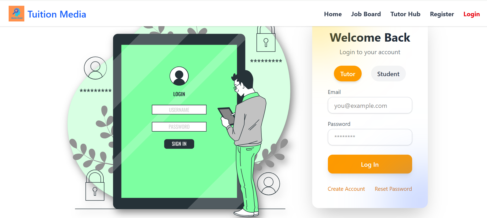
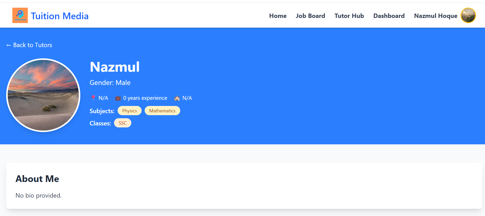
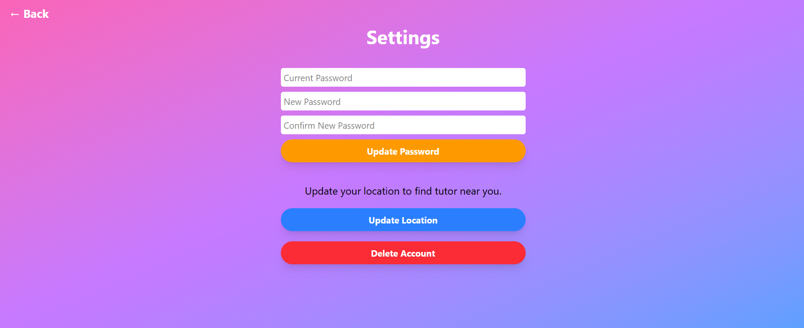

# Master Mosai 

## Project Description
<h3> **Master Mosai** is a full-stack application designed for students and tutors.  
Students can find tutors based on subjects, and tutors can manage their sessions, applications, and bookings. </h3> 

## Technologies
**Frontend:**  
- React  
- Axios (API calls)  
- Tailwind CSS  

**Backend:**  
- Node.js + Express.js  
- MySQL  
- JWT for authentication  
- SendGrid for email verification  

## Features
- Student registration and login  
- Tutor registration and login  
- Search and apply for tutors  
- View tutor profiles and send requests  
- Admin functionalities (approve/reject tutors)  
- Email verification for users  
- Password reset and recovery 
- Find Nearest Tutor
- Update Profile info 

## Deployment
- Frontend: **Vercel**  
- Backend & Database: **Railway**  

## Remote Access
[Click here](https://tuition-media-one.vercel.app)

## Download Locally
Clone the project:  
git clone https://github.com/nazmul-hoque-nahid/tuition-media.git

## Setup Instructions

**Frontend**
cd frontend
npm install
npm run dev

**Backend**
cd backend
npm install
npm run dev
# Create a .env file with your DB credentials and JWT_SECRET

## Developers 
## Nazmul Hoque  
- GitHub: [nazmul-hoque-nahid](https://github.com/nazmul-hoque-nahid)  
- Email: nazmulhoque.swe@gmail.com 
## Shorifuzzaman Shuvo
- GitHub:
- Email:shorifuzzaman1009@gmail.com
